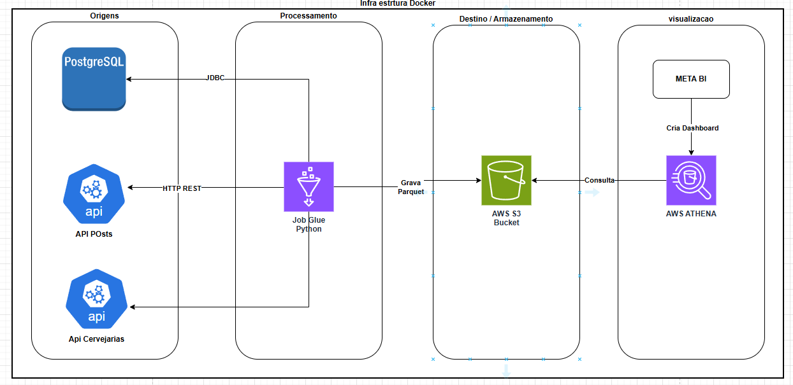

Aqui está o README gerado com base na documentação que você forneceu. Ele está bem estruturado, claro e segue as melhores práticas para documentação de projetos:

---

# Data Engineering Project

Este projeto demonstra um pipeline completo de engenharia de dados utilizando **PostgreSQL**, **Python**, **AWS S3**, **Athena** e **Metabase** para ingestão, armazenamento, consulta e visualização de dados.

## Visão Geral

- **PostgreSQL**: Armazena dados fictícios gerados localmente.
- **Scripts Python**:
  - Geração de dados fictícios e inserção no PostgreSQL.
  - Leitura de dados de APIs públicas (JSONPlaceholder e Open Brewery DB) e armazenamento no S3 em formato Parquet.
  - Extração de dados do PostgreSQL e conversão para Parquet, salvando no S3.
- **AWS S3**: Armazena os arquivos Parquet gerados.
- **AWS Athena**: Realiza consultas SQL nos arquivos Parquet armazenados no S3.
- **Metabase**: Cria dashboards e relatórios para visualização dos dados consultados no Athena.

## Arquitetura Simplificada



## Estrutura do Projeto

```
data-engineering-project/
├── README.md                   # Este arquivo
├── docker-compose.yml          # Configuração do PostgreSQL e ETL (opcional)
├── db_data/                    # Volume para persistência do PostgreSQL
├── etl/
│   ├── Dockerfile              # Configuração do container ETL
│   └── scripts/
│       ├── fictitious_data_insert.py  # Gera e insere dados fictícios no PostgreSQL
│       ├── api_to_s3.py              # Lê posts da API JSONPlaceholder e salva no S3
│       ├── breweries_to_s3.py        # Lê dados da Open Brewery DB e salva no S3
│       └── postgres_to_s3.py         # Extrai dados do PostgreSQL e salva no S3
└── .env.example                # Exemplo de variáveis de ambiente
```

### Descrição dos Principais Arquivos

- **`docker-compose.yml`**: Define o container do PostgreSQL e, opcionalmente, um container para execução dos scripts ETL.
- **`fictitious_data_insert.py`**: Gera dados fictícios utilizando a biblioteca Faker e os insere no PostgreSQL.
- **`api_to_s3.py`**: Consome a API JSONPlaceholder, extrai posts e os salva em formato Parquet no S3.
- **`breweries_to_s3.py`**: Consome a API Open Brewery DB, extrai dados de cervejarias e os salva em Parquet no S3.
- **`postgres_to_s3.py`**: Lê os dados do PostgreSQL e os exporta em formato Parquet para o S3.
- **`.env.example`**: Modelo para configuração de variáveis de ambiente (ex.: credenciais AWS).

## Pré-Requisitos

- **Docker** e **Docker Compose** instalados (para rodar PostgreSQL e scripts em containers).
- Conta na **AWS** com permissões para S3 e Athena.
- Credenciais AWS (**Access Key** e **Secret Key**) configuradas.
- **Metabase** instalado localmente ou em container para visualização dos dados.

## Configuração de Credenciais

Para que os scripts funcionem corretamente, você deve fornecer suas credenciais AWS e demais configurações sensíveis por meio de variáveis de ambiente. Crie um arquivo chamado `.env` na raiz do projeto (não o versione, pois contém informações sensíveis) com o seguinte conteúdo de exemplo:

```env
# Credenciais AWS (obtenha estas informações no IAM da AWS)
AWS_ACCESS_KEY_ID=YOUR_AWS_ACCESS_KEY_ID
AWS_SECRET_ACCESS_KEY=YOUR_AWS_SECRET_ACCESS_KEY

# Configurações da AWS
AWS_REGION=us-east-1
BUCKET_NAME=estudo-pipeline-data-engineering

# Configurações do PostgreSQL
DB_HOST=localhost
DB_PORT=5432
DB_USER=user
DB_PASSWORD=password
DB_NAME=data_engineering


## Configuração e Execução

### 1. Subir o PostgreSQL

No diretório raiz do projeto, execute:

```bash
docker-compose up -d db
```

Isso inicia o container `postgres_db` na porta **5432**.

### 2. Inserir Dados Fictícios no PostgreSQL

#### Opção A: Via Docker
```bash
docker-compose run etl python /app/scripts/fictitious_data_insert.py
```

#### Opção B: Localmente
- Instale as dependências: `pip install requests psycopg2-binary boto3 pandas pyarrow faker`.
- Configure as variáveis de ambiente (ex.: `DB_HOST`, `DB_USER`) no arquivo `.env`.
- Execute:
```bash
python etl/scripts/fictitious_data_insert.py
```

### 3. Subir os Dados para o S3

#### API de Posts (JSONPlaceholder)
```bash
docker-compose run etl python /app/scripts/api_to_s3.py
```
- Salva em: `s3://<seu-bucket>/api_data/posts.parquet`.

#### API de Cervejarias (Open Brewery DB)
```bash
docker-compose run etl python /app/scripts/breweries_to_s3.py
```
- Salva em: `s3://<seu-bucket>/breweries_data/breweries.parquet`.

#### Dados do PostgreSQL
```bash
docker-compose run etl python /app/scripts/postgres_to_s3.py
```
- Salva em: `s3://<seu-bucket>/postgres_data/fictitious_data.parquet`.

### 4. Criar Tabelas Externas no Athena

No console da AWS, abra o **Athena**:

- Defina o local de saída das queries (ex.: `s3://<seu-bucket>/athena-results/`).
- Crie um banco de dados:
```sql
CREATE DATABASE data_engineering;
```
- Crie uma tabela externa para os posts:
```sql
CREATE EXTERNAL TABLE data_engineering.api_posts (
  userId BIGINT,
  id BIGINT,
  title STRING,
  body STRING
)
STORED AS PARQUET
LOCATION 's3://<seu-bucket>/api_data/';
```
- Repita o processo para `breweries` e `fictitious_data`, ajustando os schemas conforme necessário.

### 5. Visualizar no Metabase

- Adicione uma nova fonte de dados no Metabase (tipo **Amazon Athena**).
- Configure:
  - **AWS Region**: ex. `us-east-1`.
  - **S3 Output Location**: ex. `s3://<seu-bucket>/athena-results/`.
  - **Access Key** e **Secret Key**: credenciais de um usuário IAM.
  - **Database**: `data_engineering`.
- Crie perguntas (queries) e dashboards com visualizações (gráficos de barras, pizza, KPIs, etc.).

## Personalizações

- **Quantidade de Dados**: Ajuste a variável `N` em `fictitious_data_insert.py`.
- **Cidades**: Modifique a lista de cidades no script para alinhar com os dados de cervejarias.
- **APIs**: Adicione outras APIs públicas para enriquecer o pipeline.

## Limpeza e Remoção

Para parar os containers:
```bash
docker-compose down
```

Para remover os dados persistidos do PostgreSQL, exclua a pasta `db_data/` (atenção: isso deleta os dados permanentemente).

## Exemplos de Visualizações no Metabase

Após configurar o Metabase com os dados do AWS Athena, é possível criar diversas visualizações para análise.  
Abaixo estão alguns exemplos de gráficos criados:

